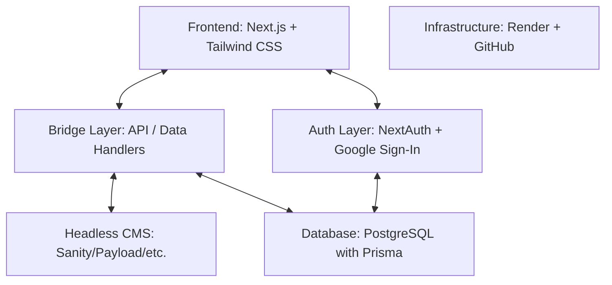

# ARCHITECTURE.md — VOIDLAB System Design

## System Architecture: The Bridge Layer

VOIDLAB follows a strictly decoupled architecture intended to keep content (marketing/catalog) and transactional data (users/orders) in their specialized systems, united by a middle "Bridge Layer".

### Data Split: CMS vs Database

| System | Role | Data Examples |
|---|---|---|
| **Headless CMS** | **Content & Branding** | Homepage copy, Hero media, Collection descriptions, Product marketing content, SEO metadata. |
| **PostgreSQL (Database)** | **Transactional & State** | User accounts, Saved addresses, Carts, Order history, Tracking status, Subscriptions. |
| **Bridge Layer** | **Transformation** | Merging CMS content with Database availability/price data to serve page-ready schemas. |

## Content Models

### CMS Models (High Level)
1. **Site Settings**: Global navigation, social links, brand settings.
2. **Homepage**: Hero, Current Drop, Philosophy section, Featured Object.
3. **Collections**: Drop labels, titles, subtitles, collection-wide assets.
4. **Product Content**: Descriptions, high-res media, marketing copy.

### Database Models (Transactional)
1. **User**: Auth data, personal info.
2. **Address**: Shipping and billing.
3. **Cart & CartItem**: Temporary shopping state.
4. **Order & OrderItem**: Immutable purchase records.
5. **Order Timeline**: Status history for fulfillment tracking.

## Visual & Interaction System

1. **The Grid**: Minimalist, high contrast, heavy use of black space (#000000).
2. **The Accent**: **Cyber Purple (#8B5CF6)** used for subtle highlights, active states, and CTA edges.
3. **The Object**: Rotating 3D views (using Three.js or high-quality video loops) on key pages.
4. **The Specs**: Technical layout for product details (Material, Finish, Edition, Dimensions).
