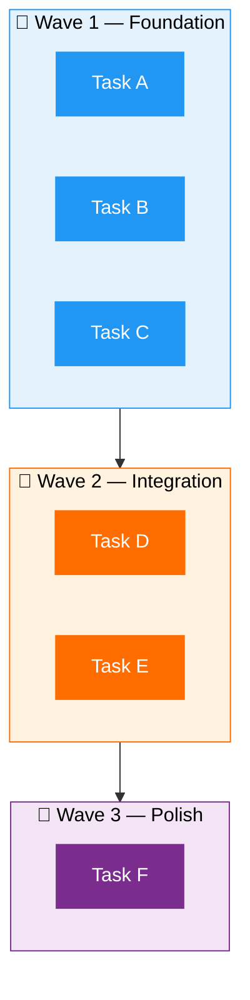

<div align="center">


# 🚀 Get Shit Done

### A spec-driven, context-engineered development methodology

[](CHANGELOG.md)
[](LICENSE)
[](https://github.com/glittercowboy/get-shit-done)
[](#-cross-platform-support)
[](#-multi-model-support)

<br/>

**Stop vibecoding. Start shipping.**

*Describe your idea → GSD extracts everything the AI needs → Watch it build correctly.*

<br/>

[Getting Started](#-getting-started) · [How It Works](#-how-it-works) · [Commands](#-commands-26-total) · [Documentation](#-documentation)

</div>

---

## 🧠 The Problem

> Vibecoding has a bad reputation — and it deserves it.

You describe what you want, AI generates code, and you get **inconsistent garbage** that falls apart at scale.

GSD fixes that. It's the **context engineering layer** that makes AI coding reliable.

<table>
<tr>
<td width="50%">

### ❌ Without GSD
```
"Add a feature"
    → Inconsistent code
    → Bugs everywhere
    → Debug loop
    → Frustration
```

</td>
<td width="50%">

### ✅ With GSD
```
"Add a feature"
    → SPEC
    → Plan
    → Atomic execution
    → Verification
    → ✅ Done
```

</td>
</tr>
</table>

> **No enterprise roleplay.** No sprint ceremonies, story points, stakeholder syncs, or Jira workflows.
> Just an incredibly effective system for building cool stuff consistently.

---

## 👤 Who This Is For

| | |
|---|---|
| 🧑‍💻 **Solo developers** | Using AI coding assistants and need consistency |
| 👥 **Small teams** | Who want structure without enterprise overhead |
| 😤 **Anyone** | Tired of AI generating inconsistent garbage |

---

## ⚡ Getting Started

<details>
<summary><b>🪟 PowerShell (Windows)</b></summary>

```powershell
# Open your project
cd your-project

# Clone the GSD template
git clone https://github.com/toonight/get-shit-done-for-antigravity.git gsd-template

# Copy to your project
Copy-Item -Recurse gsd-template\.agent .\
Copy-Item -Recurse gsd-template\.gemini .\
Copy-Item -Recurse gsd-template\.gsd .\
Copy-Item -Recurse gsd-template\adapters .\
Copy-Item -Recurse gsd-template\docs .\
Copy-Item -Recurse gsd-template\scripts .\
Copy-Item -Force gsd-template\PROJECT_RULES.md .\
Copy-Item -Force gsd-template\GSD-STYLE.md .\
Copy-Item -Force gsd-template\model_capabilities.yaml .\

# Clean up
Remove-Item -Recurse -Force gsd-template
```

</details>

<details>
<summary><b>🐧 Bash (Linux / Mac)</b></summary>

```bash
# Open your project
cd your-project

# Clone the GSD template
git clone https://github.com/toonight/get-shit-done-for-antigravity.git gsd-template

# Copy to your project
cp -r gsd-template/.agent ./
cp -r gsd-template/.gemini ./
cp -r gsd-template/.gsd ./
cp -r gsd-template/adapters ./
cp -r gsd-template/docs ./
cp -r gsd-template/scripts ./
cp gsd-template/PROJECT_RULES.md ./
cp gsd-template/GSD-STYLE.md ./
cp gsd-template/model_capabilities.yaml ./

# Clean up
rm -rf gsd-template
```

</details>

Then run `/new-project` and follow the prompts.

> [!TIP]
> You can also use `/install` from a clean project to automate the installation above.

---

## 🔄 How It Works


| Step | Command | Output |
|:----:|---------|--------|
| **1** | `/new-project` | Deep questioning → `SPEC.md` (finalized) |
| **2** | `/discuss-phase N` | Clarify scope → `DECISIONS.md` |
| **3** | `/plan N` | Technical discovery → `PLAN.md` with XML tasks |
| **4** | `/execute N` | Wave-based execution → Atomic commits |
| **5** | `/verify N` | Must-haves check → Evidence captured |
| **6** | Repeat | Next phase or `/complete-milestone` |

---

## 🧩 Why It Works

### 📦 Context Engineering

The AI is incredibly powerful **if** you give it the context it needs. Most people don't. GSD handles it for you:

| File | Role | Icon |
|------|------|:----:|
| `SPEC.md` | Project vision, always loaded | 🎯 |
| `ARCHITECTURE.md` | System understanding | 🏗️ |
| `ROADMAP.md` | Where you're going, what's done | 🗺️ |
| `STATE.md` | Decisions, blockers, memory across sessions | 💾 |
| `PLAN.md` | Atomic tasks with XML structure | 📐 |
| `SUMMARY.md` | What happened, what changed | 📝 |

> Size limits based on where AI quality degrades. Stay under, get consistent excellence.

### 🏷️ XML Prompt Formatting

Every plan is structured XML optimized for AI execution:

```xml
<task type="auto">
  <name>Create login endpoint</name>
  <files>src/app/api/auth/login/route.ts</files>
  <action>
    Use jose for JWT (not jsonwebtoken - CommonJS issues).
    Validate credentials against users table.
    Return httpOnly cookie on success.
  </action>
  <verify>curl -X POST localhost:3000/api/auth/login returns 200 + Set-Cookie</verify>
  <done>Valid credentials return cookie, invalid return 401</done>
</task>
```

Precise instructions. No guessing. Verification built in.

### 🌊 Wave-Based Execution

Plans are grouped into waves based on dependencies:



Each executor gets **fresh context**. Your main session stays fast.

### 🔗 Atomic Git Commits

Each task gets its own commit immediately after completion:

```
abc123f feat(phase-1): create login endpoint
def456g feat(phase-1): add password validation
hij789k feat(phase-1): implement JWT cookie handling
```

> **Why?** Git bisect finds exact failing task · Each task independently revertable · Clear history for AI in future sessions

### 🔬 Empirical Verification

No "trust me, it works." Every verification produces evidence:

| Change Type | Evidence Required |
|:---:|:---:|
| 🌐 API endpoint | `curl` output |
| 🖥️ UI change | Screenshot |
| 🏗️ Build | Command output |
| 🧪 Tests | Test results |

---

## 🎮 Commands (26 Total)

> [!NOTE]
> Slash commands are typed directly as chat messages (e.g. send `/plan 1`). They are **not** IDE autocomplete features — if your editor shows "nothing found" when pressing `/`, that's normal. Just type the full command and send it.

### 🔵 Core Workflow

| Command | Purpose |
|---------|---------|
| `/map` | 🏗️ Analyze codebase → `ARCHITECTURE.md` |
| `/plan [N]` | 📐 Create `PLAN.md` for phase N |
| `/execute [N]` | ⚙️ Wave-based execution with atomic commits |
| `/verify [N]` | ✅ Must-haves validation with proof |
| `/debug [desc]` | 🐛 Systematic debugging (3-strike rule) |

### 🟢 Project Setup

| Command | Purpose |
|---------|---------|
| `/install` | 📦 Install GSD from GitHub |
| `/new-project` | 🆕 Deep questioning → `SPEC.md` |
| `/new-milestone` | 🏁 Create milestone with phases |
| `/complete-milestone` | 🎉 Archive completed milestone |
| `/audit-milestone` | 🔍 Review milestone quality |

### 🟠 Phase Management

| Command | Purpose |
|---------|---------|
| `/add-phase` | ➕ Add phase to end of roadmap |
| `/insert-phase` | 📌 Insert phase (renumbers) |
| `/remove-phase` | ➖ Remove phase (safety checks) |
| `/discuss-phase` | 💬 Clarify scope before planning |
| `/research-phase` | 🔬 Deep technical research |
| `/list-phase-assumptions` | 📋 Surface planning assumptions |
| `/plan-milestone-gaps` | 🔧 Create gap closure plans |

### 🟣 Navigation & State

| Command | Purpose |
|---------|---------|
| `/progress` | 📊 Show current position |
| `/pause` | ⏸️ Save state for session handoff |
| `/resume` | ▶️ Restore from last session |
| `/add-todo` | 📝 Quick capture idea |
| `/check-todos` | 📋 List pending items |

### 🔴 Utilities

| Command | Purpose |
|---------|---------|
| `/help` | ❓ Show all available commands |
| `/web-search` | 🌐 Search the web for decisions |
| `/whats-new` | 📢 Show recent GSD changes |
| `/update` | ⬆️ Update GSD to latest version |

---

## 💡 Typical Session

```bash
/resume              # ← Load context from last session
/progress            # ← See where you left off
/discuss-phase 2     # ← Clarify requirements (optional)
/plan 2              # ← Plan next phase
/execute 2           # ← Implement with atomic commits
/verify 2            # ← Prove it works (screenshots, tests)
/pause               # ← Save state for later
```

> [!IMPORTANT]
> GSD forces **planning before coding**. The AI can't write code until `SPEC.md` says `FINALIZED`. This prevents building the wrong thing.

---

## 🔒 Core Rules

| | Rule | Why It Matters |
|:---:|------|----------------|
| 🔒 | **Planning Lock** | No code until `SPEC.md` is `FINALIZED` — prevents building wrong thing |
| 💾 | **State Persistence** | Update `STATE.md` after every task — memory across sessions |
| 🧹 | **Context Hygiene** | 3 failures → state dump → fresh session — prevents circular debugging |
| ✅ | **Empirical Validation** | Proof required — no "it should work" |

---

## 🌍 Cross-Platform Support

All workflow files include **dual syntax** — both PowerShell and Bash commands.

| Platform | Instructions |
|:--------:|:------------:|
| 🪟 **Windows** | Use PowerShell blocks |
| 🐧 **Linux / Mac** | Use Bash blocks (may require `jq`) |

> Git commands (`git add`, `git commit`, `git tag`) are cross-platform and work identically everywhere.

---

## 🤖 Multi-Model Support

GSD is **model-agnostic** — use any LLM that works in your environment.

### Canonical Rules

All rules live in [PROJECT_RULES.md](PROJECT_RULES.md) — the single source of truth.

### Optional Adapters

Model-specific enhancements *(optional, never required)*:

```
adapters/
├── CLAUDE.md     # Extended thinking, effort levels
├── GEMINI.md     # Flash vs Pro selection
└── GPT_OSS.md    # Function calling, context handling
```

### Model Selection by Phase

| Phase | Recommended | Why |
|:-----:|:-----------:|-----|
| 📋 Planning | Reasoning models | Complex decisions |
| ⚙️ Implementation | Fast models | Iteration speed |
| 🐛 Debugging | Reasoning models | Hypothesis testing |
| 🔍 Review | Long-context models | Full diff analysis |

> See [model-selection-playbook.md](docs/model-selection-playbook.md) for detailed guidance.

---

## 🔍 Search-First Mode

> **Principle:** Search before reading files completely.

### Why?

- 🎯 Reduces context pollution
- ⚡ Faster codebase understanding
- 🚫 Prevents reading irrelevant code

<details>
<summary><b>Setup (Optional)</b></summary>

**PowerShell:**
```powershell
.\scripts\setup_search.ps1          # Checks for ripgrep/fd
.\scripts\search_repo.ps1 "pattern" # Search wrapper
```

**Bash:**
```bash
./scripts/setup_search.sh           # Checks for ripgrep/fd
./scripts/search_repo.sh "pattern"  # Search wrapper
```

> **No installation required** — falls back to built-in tools (`Select-String` / `grep`).

</details>

### Workflow

1. **Define question** — What are you looking for?
2. **Search first** — `.\scripts\search_repo.ps1 "keyword"`
3. **Evaluate results** — Which files matter?
4. **Targeted read** — Only read relevant sections

---

## 💰 Token Optimization

> **Principle:** Minimize token consumption while maintaining quality.

### Skills Available

| Skill | Purpose |
|-------|---------|
| 📊 `token-budget` | Track and manage token usage |
| 🗜️ `context-compressor` | Compress context for efficiency |
| 🔍 `context-fetch` | Search-first loading |
| 🩺 `context-health-monitor` | Detect quality degradation |

### Budget Thresholds

| Usage | Status | Action |
|:-----:|:------:|--------|
| 0–50% | 🟢 OK | Proceed normally |
| 50–70% | 🟡 Warning | Compress, use outlines |
| 70%+ | 🔴 Critical | State dump required |

> See [token-optimization-guide.md](docs/token-optimization-guide.md) for complete strategies.

---

## 📁 File Structure

```
📄 PROJECT_RULES.md          # ← Canonical rules (model-agnostic)
📄 GSD-STYLE.md              # Complete style guide

📂 .agent/
├── 📂 workflows/            # 25 slash commands
└── 📂 skills/               # 11 agent specializations

📂 .gemini/
└── 📄 GEMINI.md             # Gemini integration

📂 .gsd/
├── 📄 SPEC.md               # ← START HERE (finalize first)
├── 📄 ROADMAP.md            # Phases and progress
├── 📄 STATE.md              # Session memory
├── 📄 ARCHITECTURE.md       # System design (/map output)
├── 📄 STACK.md              # Tech inventory
├── 📄 DECISIONS.md          # Architecture Decision Records
├── 📄 JOURNAL.md            # Session log
├── 📄 TODO.md               # Quick capture
├── 📂 templates/            # Document templates
└── 📂 examples/             # Usage walkthroughs

📂 adapters/                 # Optional model-specific enhancements
├── 📄 CLAUDE.md
├── 📄 GEMINI.md
└── 📄 GPT_OSS.md

📂 docs/                     # Operational documentation
├── 📄 model-selection-playbook.md
└── 📄 runbook.md

📂 scripts/                  # Utility scripts
├── 📄 validate-*.ps1/.sh    # Structure validators
├── 📄 setup_search.ps1/.sh  # Search tool setup
└── 📄 search_repo.ps1/.sh   # Search wrapper

📄 model_capabilities.yaml   # Optional capability registry
```

---

## 🧪 Testing

Run validation scripts to verify GSD structure:

<details>
<summary><b>🪟 PowerShell</b></summary>

```powershell
.\scripts\validate-all.ps1        # Run all validators
.\scripts\validate-workflows.ps1  # Workflows only
.\scripts\validate-skills.ps1     # Skills only
```

</details>

<details>
<summary><b>🐧 Bash</b></summary>

```bash
./scripts/validate-all.sh         # Run all validators
./scripts/validate-workflows.sh   # Workflows only
./scripts/validate-skills.sh      # Skills only
```

</details>

---

## 📚 Documentation

| Resource | Description |
|----------|-------------|
| [PROJECT_RULES.md](PROJECT_RULES.md) | Canonical model-agnostic rules |
| [GSD-STYLE.md](GSD-STYLE.md) | Complete style and conventions guide |
| [Model Selection Playbook](docs/model-selection-playbook.md) | Model selection guidance |
| [Runbook](docs/runbook.md) | Operational procedures |
| [Token Optimization Guide](docs/token-optimization-guide.md) | Token efficiency strategies |
| [Examples](.gsd/examples/) | Usage walkthroughs and quick reference |
| [Templates](.gsd/templates/) | Document templates for plans, verification |

---

## 🧠 Philosophy

<table>
<tr>
<td>🎯</td><td><b>Plan before building</b> — <code>SPEC.md</code> matters more than you think</td>
</tr>
<tr>
<td>🧹</td><td><b>Fresh context > polluted context</b> — State dumps prevent hallucinations</td>
</tr>
<tr>
<td>🔬</td><td><b>Proof over trust</b> — Screenshots and command outputs, not "looks right"</td>
</tr>
<tr>
<td>⚛️</td><td><b>Aggressive atomicity</b> — 2–3 tasks per plan, atomic commits</td>
</tr>
<tr>
<td>🔍</td><td><b>Search before reading</b> — Don't load files blindly</td>
</tr>
<tr>
<td>💰</td><td><b>Token-efficient</b> — Every token counts</td>
</tr>
<tr>
<td>🤖</td><td><b>Model-agnostic</b> — Works with any capable LLM</td>
</tr>
<tr>
<td>🚫</td><td><b>No enterprise theater</b> — Solo dev + AI workflow only</td>
</tr>
</table>

---

<div align="center">

<sub>Adapted from <a href="https://github.com/glittercowboy/get-shit-done">glittercowboy/get-shit-done</a> for Google Antigravity</sub>

<br/>

[](https://github.com/toonight/get-shit-done-for-antigravity)

</div>